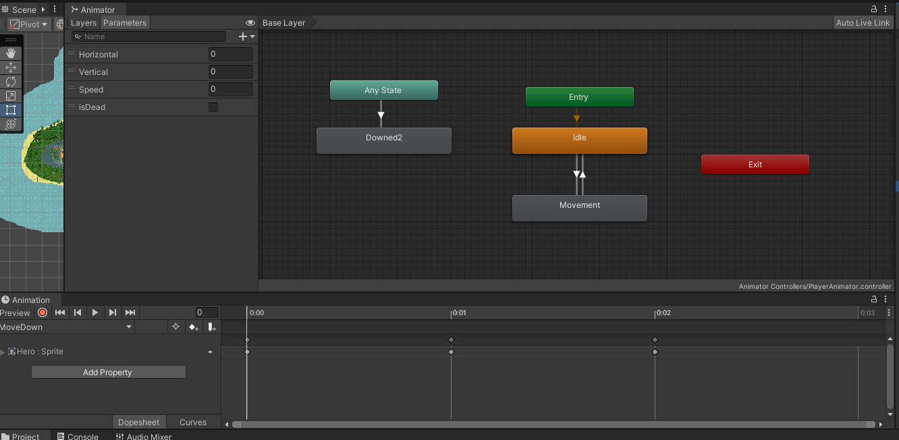
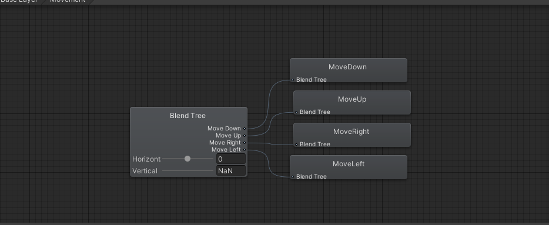

# Game Basic Information #

## Summary ##

Immerse yourself in the breathtaking world of Sovereign Saga, an immersive 2D RPG ripe with adventure. Venture through the challenges and opportunities found within a diverse island, each step taking you closer to becoming its ruler. Make your way through the diverse terrains, where your tactical prowess will be tested against an army of slimes. Employ combat strategies and economic ventures, using your wealth to ascend in power. In Sovereign Saga, your destiny is in your hands. Do you have the mettle to conquer and rule?

## Gameplay Explanation ##

2D RPG game where the goal is to become a ruler of the island. You start off with very limited money, and choose an approach to generate income in order to improve your title or standing in the society. The player has starting stats for Stamina, Strength, and Intelligence, and improves them over the course of the game.

The island will be divided into different regions. Players can choose from multiple approaches to generate money, shaping their path to rulership. Players can participate in thrilling battles in the caves, or even become early businessmen to generate passive income by obtaining all the land property on the islands. The world will be filled with varieties of magic that can be acquired by the player to use in combat. As players play and generate some wealth, they will be able to invest their resources in upgrading their character’s abilities and unlocking new skills. Stamina is the character’s overall endurance and energy in physical tasks that allows the player to dash in combat. Strength is combat prowess. Intelligence is used for dwelling into the world of Arcana.

CONTROL SCHEME:

MOVEMENT: WASD OR ARROW KEYS

COMBAT: LEFT MOUSE CLICK

DASH: SPACE

MAGIC: Z = fireball; X = rock; C = tornado; Q = Vortex

**If you did work that should be factored in to your grade that does not fit easily into the proscribed roles, add it here! Please include links to resources and descriptions of game-related material that does not fit into roles here.**

# Main Roles #

Your goal is to relate the work of your role and sub-role in terms of the content of the course. Please look at the role sections below for specific instructions for each role.

Below is a template for you to highlight items of your work. These provide the evidence needed for your work to be evaluated. Try to have at least 4 such descriptions. They will be assessed on the quality of the underlying system and how they are linked to course content. 

*Short Description* - Long description of your work item that includes how it is relevant to topics discussed in class. [link to evidence in your repository](https://github.com/dr-jam/ECS189L/edit/project-description/ProjectDocumentTemplate.md)

Here is an example:  
*Procedural Terrain* - The background of the game consists of procedurally-generated terrain that is produced with Perlin noise. This terrain can be modified by the game at run-time via a call to its script methods. The intent is to allow the player to modify the terrain. This system is based on the component design pattern and the procedural content generation portions of the course. [The PCG terrain generation script](https://github.com/dr-jam/CameraControlExercise/blob/513b927e87fc686fe627bf7d4ff6ff841cf34e9f/Obscura/Assets/Scripts/TerrainGenerator.cs#L6).

You should replay any **bold text** with your relevant information. Liberally use the template when necessary and appropriate.

## Producer (Georgy Zaets - gzaets@ucdavis.edu - @gzaets)

**Describe the steps you took in your role as producer. Typical items include group scheduling mechanism, links to meeting notes, descriptions of team logistics problems with their resolution, project organization tools (e.g., timelines, depedency/task tracking, Gantt charts, etc.), and repository management methodology.**

*   As a producer for the Sovereign Saga, my  experience in project management was instrumental in successfully driving the game development process. My primary focus was to ensure the timely and high-quality delivery of the project components, all while fostering a collaborative environment within the team. I implemented an efficient group scheduling mechanism thourgh Discord that streamlined communication, all changes on the GitHub repo and project timelines. I created task tracking channels to provide transparency and accountability among team members for the work that each individual does. This also enabled us to identify and resolve logistic and merging issues promptly, ensuring more-or-less smooth operations throughout the project's lifecycle. Using proper repository practices on GitHub allowed the team to integrate their work seamlessly into the project, reducing chances of conflicts or loss of work. The use of this system greatly enhanced the team's productivity and the overall project's progress.

*   One of the critical aspects of my role was to ensure the quality of the game. I actively managed the testing and bug tracking process, prioritizing issues and tasks based on severity and impact. This not only improved the game's performance but also significantly contributed to the game's immersive and bug-free experience. I allocated pretty much the entirety of 24 hours after the Gameplay Showcase to fix as many of the buggs as possible that were found by my class peers and Professor McCoy during play-testing (more on that later). As a team lead, I cultivated an environment that encouraged innovation and creativity. My role involved maintaining open lines of communication, resolving conflicts, and motivating the team. I grouped people together based on the tasks they were working on and ensured proper collaboration between my sub-teams to make sure no merge conflicts are present. This had a profound impact on the team's morale and overall productivity.

*   The resulting product of the latest build of Sovereign Saga is a representation to our team's hard work and dedication. It offers players an immersive gameplay/speedrunning experience filled with thrilling battles, strategic economic ventures, and a quest for rulership. Players can navigate through diverse terrains, strategize against an army of slimes, and employ magic acquired throughout the game. All this while aiming for one primary goal – becoming the rich ruler of the islands! I had to step in for a few tasks/team members, which I will write more about in Game Feel section at the end. I believe my role as the producer greatly contributed to the successful completion of Sovereign Saga. The project management skills, combined with my passion for game development, not only helped manage resources efficiently but also ensured a high-quality, immersive gaming experience for our audience.

*Pause Menu/Main Menu*  
*   As a critical part of our game development process, I implemented the main menu and pause menu functionality in the Sovereign Saga game. This involved writing efficient code to control these menus' behavior, providing the player with an intuitive and visually appealing user interface.

* *[MainMenu.cs](https://github.com/gzaets/ECS189LGroupProject/blob/master/Sovereign%20Saga/Assets/Scripts/MainMenu.cs)* 

    *   Can be found at *[MainMenu.unity](https://github.com/gzaets/ECS189LGroupProject/blob/master/Sovereign%20Saga/Assets/Scenes/MainMenu.unity)*
    
    *   I re-built the Main Menu logic and UI based on the foundation that @mohalibou made before hand. I changed the visuals, added a moving/scrolling background, added a 'How To Play" section, changed the color/lighting of the letters and button highlights. 
    
    *   I developed a MainMenu script that controls the behavior of different elements within the main menu, including the backButton, smallTitle, quitButton, text, and loadingScreen.

    *   In the Start method, I specified which elements should be visible when the menu initially loads. For instance, the backButton, smallTitle, and text are set to inactive, while the quitButton is active.

    

    *   I also introduced a boolean flag isTutorial to determine if the "How to Play" tutorial should be shown. When the player selects "How to Play", the ShowHowToPlay method sets isTutorial to true. Similarly, when the player clicks the back button, the Back method sets isTutorial to false.

    

    *   To handle the game exit request, the QuitGame method utilizes the Application.Quit() function which is a standard way to quit a game in Unity.

    *   I implemented smooth scene transitions in *[LevelLoader.cs](https://github.com/gzaets/ECS189LGroupProject/blob/master/Sovereign%20Saga/Assets/Scripts/LevelLoader.cs)* and loading animations to enhance the overall player experience. The goal was to create seamless transitions between the main menu and game scenes, and provide visual feedback during the loading of a new scene. Scene transitions were handled using Unity's SceneManager. While SceneManager.LoadScene performs the actual transition, to make it smoother, I introduced a loading screen with an animation. This loading screen serves a dual purpose - it visually indicates that the game is loading a new scene and provides a buffer, masking any potential lag or stuttering during scene transition. When a scene transition is initiated, I activate the loadingScreen before calling SceneManager.LoadScene. This means the loading screen will appear immediately once the player initiates the transition, and remain visible throughout the scene loading process.

    

* *[PauseMenu.cs](https://github.com/gzaets/ECS189LGroupProject/blob/master/Sovereign%20Saga/Assets/Scripts/PauseMenu.cs)*

    *   I implemented the PauseMenu script to control the pause functionality in the game. This script handles pause menu activation, game pausing and resuming, and quitting the game. The visual style resembles the style of the Main Menu of the game.

    *   In the Start method, the pauseMenu GameObject is set to inactive, ensuring the pause menu does not appear when the game initially starts.

    *   The Update method checks every frame if the player has pressed the Escape key. Depending on whether the pause menu is already active, it will either pause or resume the game. The game's pausing and resuming is controlled by the PauseGame and ResumeGame methods, respectively. These methods not only toggle the visibility of the pause menu but also adjust the Time.timeScale property to pause and resume game time, and set the boolean pausedGame flag accordingly.

    *   Finally, the MainMenu method allows players to return to the main menu from the pause menu. It deactivates the pause menu, resumes game time, and uses SceneManager.LoadScene("MainMenu") to load the main menu scene.

    

*Slime Controller and Spawner*  

*   As a crucial part of the game mechanics, I created a spawn system for the enemy, "slime," and provided the slimes with necessary behaviors such as chasing the player, dealing damage, and reacting upon being attacked.

* *[SlimeController.cs](https://github.com/gzaets/ECS189LGroupProject/blob/master/Sovereign%20Saga/Assets/Scripts/SlimeController.cs)* 

    *   This script is attached to each individual slime, giving them their behaviors and properties.

    *   Upon spawning (Start method), the slime is assigned attributes based on its type (Green, Blue, Red). This differentiation allows for a variety of enemy behaviors, presenting varying challenges to the player. The SpriteRenderer and AudioSource components are also retrieved here to manipulate the slime's visual direction and play sounds.

    *   During each frame update (Update method), the slime tries to move towards the player, unless it has collided with an object or is stunned. The slime's sprite is flipped based on its movement direction to give it a more natural appearance. If the slime has collided with something, it will be knocked back for a specified time. If the slime has taken damage, it is stunned and stops moving for a certain duration.

* *[SlimeSpawner.cs](https://github.com/gzaets/ECS189LGroupProject/blob/master/Sovereign%20Saga/Assets/Scripts/SlimeSpawner.cs)*

    *   This script is attached to the object *SlimeSpawner* in the *[MainIsland.unity](https://github.com/gzaets/ECS189LGroupProject/blob/master/Sovereign%20Saga/Assets/Scenes/MainIsland.unity)* scene which serves as the spawn point for the slimes. It manages the spawning of slimes based on the provided conditions.

    *   At the start, it begins the SpawnSlime coroutine, which runs separately from frame updates, making it suitable for time-delayed actions like spawning. The coroutine is called repeatedly until the game is paused or the player is dead.

    *   In the SpawnSlime coroutine, slimes are spawned infinitely as long as the spawnDelay is above 0.5 seconds. The delay between spawns is gradually decreased to increase the difficulty over time. A slime prefab is selected randomly from an array, and a new slime is instantiated. The Hero instance is assigned to the newly spawned slime to allow it to interact with the player by following and facing it. Slimes only spawn if the player is in the correct area and the game is not paused.

*   By implementing these scripts, I managed to create an engaging enemy system that poses an increasing challenge to the player, enhancing the game's dynamics and overall fun.

## User Interface (Mohamed Ali Boutaleb @mohalibou)

When designing the user interface, I wanted to follow a design pattern where the UI design aesthetic is simple, clean, and intuitive. The aim is to make all crucial information readily available to the player without overwhelming the game screen. The UI is designed to be glanceable, ensuring that important information is accessible but does not obstruct the player's immersion in the game world.

I utilized a combination of unity UI elements, custom made images, custom fonts, and a collection of [SF Symbols](https://developer.apple.com/sf-symbols/) provided by Apple in order to make the user interface.

*Player Stat Display* - On the top left of the screen, I implemented a UI panel that shows the player's stats. This includes health, stamina, intelligence, strength, and money. This information is critical for players as they navigate the island, strategize their growth, and make decisions on resource allocation and skill upgrades. [Image of the UI element.](https://imgur.com/a/l4uHYS5) [Code for the implementation.](https://github.com/gzaets/ECS189LGroupProject/blob/127c1085e9f14134a3a231ccaae2a65f347e3172/Sovereign%20Saga/Assets/Scripts/PlayerController.cs#L265-L276)

*Building Purchases Popups* - Whenever a player wants to make building purchases, there will be a pop-up UI that provides only the necessary details related to purchasing the building. These pop-ups were designed to be informative yet unobtrusive, ensuring that players can easily continue their gameplay after making their decisions. [Image of the UI element.](https://imgur.com/a/QpFgE2e) [Code for the implementation.](https://github.com/gzaets/ECS189LGroupProject/blob/95fb360e1d161850f159c9be5be817f74850d85c/Sovereign%20Saga/Assets/Scripts/BuildingItem.cs#L99-L100)

*Game Over/Main Menu* - I also designed the game over menu, and main menu, providing players with options to exit or enter the game without disrupting the flow of the game. These UI elements I made were later improved upon by other memebers who wanted to incorporate their own improvements or game mechanics for their own usage. [Images of the UI elements.](https://imgur.com/a/WXdIOrW) [Code for swapping scenes between the main menu and the game world.](https://github.com/gzaets/ECS189LGroupProject/blob/8064c282ef477012e9b929734c1cb52955400d0c/Sovereign%20Saga/Assets/Scripts/SceneSwitcher.cs#L1-L14)

It took a lot of time for me to get these UI elements working just right. There was a lot of tweaking, adjusting, and gameplay testing I needed to do to ensure that everything worked as intended. I go more in detail on the gameplay testing in my subrole section.

One of the great benefits that came with my UI designs was how modular they were. There were other uses for my UI elements that other members wanted to implement that I was not able to implement directly. This modularity made it possible to easily scale the UI, adapt it to new requirements, and integrate new features without disrupting the overall design. An excelent example of this involved the main menu scene I wrote. Other members were able to significantly improve the foundation I set for it without much hassle, and make the experience significantly better to fit the wishes of the individual. There is another excellent example of this with the building purchases UI, which is explained below.

*Addition Building Purchase Popups (Payday2021)* - Added additional popup UIs for building purchasing that would prompt the hero whether the building has already been purchased or if the hero does not have enough money to purchase. 

## Movement/Physics (@j-p-ecs, Personal Name Hidden for Privacy Reasons)

The following has been written by @j-p-ecs (GitHub username):

Physics has been implemented in part manually and in part using Unity’s physics engine.

Unity’s physics engine is used to handle collisions in situations where trying to handle it manually would be nontrivial or otherwise extremely tedious, especially dealing with irregular polygons such as consecutive tiles of water. 

Building collision physics were, on the other hand, programmed manually and seek to optimize the player experience with no slowdowns resulting from rubbing against walls, etc. This is contrary to water tiles, which incur a slowdown if the player rubs against them because those rely solely on Unity’s physics engine.

Physics were primarily implemented by attaching Collider and Rigidbody components to the desired objects. In cases where we want to control the behavior more precisely, we added tags to some objects to determine whether special behavior should occur. For example, cave doors have a tag that is checked for during a collision and if the tag matches, it will determine which portion of the dungeon the player should be transported to.

Another aspect of physics which I incorporated was knockback with regards to collision with slime objects. My approach here basically involved setting a knockback animation time, which I calibrated to be about a third of a second. During that third of a second, if a collision occurred, and depending on how forceful the collision is, the slime would move back at some multiple of the collision speed. In our testing, it was a decent and smooth implementation. It may not be absolutely perfect by all standards, but I am decently satisfied with the result. When the slime takes damage, an addition was made to also give half a second of stunned time; however, this particular addition was not done by me but by another team member.

Regarding collisions with cliffs, I had challenges figuring out how to implement this with Unity without defacing a beautiful map design. The strategy I decided to go with was duplicating the design with another attachment, then setting the layer to be a very low number so that the layer would not be seen during gameplay (i.e. layer -99). I then attached a tilemap collider to that component and removed the appropriate tiles from that layer as necessary. If this was not done, this would cause the player to be unable to traverse through significant portions of the map. I did investigate working with Edge Colliders, but I was unable to figure out how to get those working.

Physics has different modes, which was a feature we intended to implement during the beginning of this project. When health is high, the player will move at a relatively high speed compared to when the health is low. When the health is low, the player will move slower and may subsequently struggle to move away from slime enemies. In addition, there is a dash effect that gives the player a short boost for a given period of time, and an effect (created by @fdang2000) will appear when that movement has occurred.

The following are not directly related to physics but were implemented by @j-p-ecs:

I utilized the base code that was used to implement building purchases (which was done by other teammates, including @payday2021) to implement magic combat ability purchases. This was a relatively trivial implementation that involved creating a script to display the appropriate purchasing UI upon colliding with an NPC in the overworld. After a purchase has occurred with the NPC, then I use the Destroy function to remove the object.

I also created the game win screen, which uses the template created by @mohalibou for the game over screen. The game win screen is equipped with the proper transitions.

I also worked with the logic relating to the game over. In particular, the game has been programmed so the player does not move when a game over has been reached, regardless of any input given.

*Building Purchases Popups* - Whenever a player wants to make building purchases, there will be a pop-up UI that provides only the necessary details related to purchasing the building. These pop-ups were designed to be informative yet unobtrusive, ensuring that players can easily continue their gameplay after making their decisions. [Image of the UI element.](https://imgur.com/a/QpFgE2e) [Code for the implementation.](https://github.com/gzaets/ECS189LGroupProject/blob/95fb360e1d161850f159c9be5be817f74850d85c/Sovereign%20Saga/Assets/Scripts/BuildingItem.cs#L99-L100)

*Game Over/Main Menu* - I also designed the game over menu, and main menu, providing players with options to exit or enter the game without disrupting the flow of the game. [Images of the UI elements.](https://imgur.com/a/8BAxONR) [Code for swapping scenes between the main menu and the game world.](https://github.com/gzaets/ECS189LGroupProject/blob/8064c282ef477012e9b929734c1cb52955400d0c/Sovereign%20Saga/Assets/Scripts/SceneSwitcher.cs#L1-L14)

## Animation and Visuals (Fred Dang @fdang2000)

**List your assets including their sources and licenses.**

**Describe how your work intersects with game feel, graphic design, and world-building. Include your visual style guide if one exists.**

**Fred Dang (Animations and Visuals 1)**

*   **Animations**
    * For hero movement, I did not want the player to just simply slide across the screen as this would break from immersion and game feel, so I created animations for the cardinal directions and implemented them. In order to further improve game feel, I wanted the player to idle at the direction that they were last facing. To do so, I created blend trees in the Unity Animator for movement and idle states and switched between the two. Blend trees for movement/idle states take into account horizontal and vertical input to determine which animation should be played. These two attributes are parameters that are set in the PlayerController.cs. I also have transitions from any of these states to a "dead" state when the player dies which triggers the death animation. All of these implementations are to improve game feel to make it more realistic in this context. 

    * I also created animations for all magic skills and the sword slash using borrowed sprites. 
        * For magic skills, each magic sprite came with a sprite sheet that shows it in different states. For example, the fireball as it throughout time. This makes the fireball more realistic since it is not simply one sprite but rather multiple sprites of the fireball in different states to bring out realism which improves game feel. This can be seen for the other three skills which follow identical principles: the suck, rock, and tornado. Animating these skills were simply adjusting changing the sprites of the game object.

        * The sword animation is a bit more complex. It uses a sprite that was borrowed in the credits below. I had to create an idle animation for the sword where it would just be one sprite since nothing is occurring. However, when the sword slashed, I animated the sword rotating as well as toggling its hitbox on/off and making it appear and disappear. To make sync these changes with the combat system, I had to use animation events to tell the WeaponController.cs when the hitbox was on or off. In doing so, I created a sword that slashes around the player and disappears when the slash is finished because a floating sword would look weird. As such, all these changes improve game feel. 
            * While most animations had no fade time or exit time, the slash animation had to have one to make it slowly fade back so it did not look weird when the sword instantly returned to its original position. Again, this is for the sake of game feel. 

        * I also created an animation to simulate a "after-image" effect when dashing. I thought that this would improve game feel since increasing the player's movement speed temporarily is boring. With this, the player can "feel" the increased speed as seen by the after images. Animation-wise, the after image is a copy of the hero that plays an animation where it changes colors and slowly fades out. It also would not loop since it deletes after finishing the animation. 

* **Visuals**
    * For visuals, I chose these assets: 
        * [10 Pixel Magic Spell Effects with Icons](https://foozlecc.itch.io/pixel-magic-sprite-effects) by Foolze licensed under Creative Commons Zero, CC0.
        * [20 Evolving Fantasy RPG Weapons](https://assetstore.unity.com/packages/2d/textures-materials/20-evolving-fantasy-rpg-weapons-61204) by Landon Grant licensed under Standard Unity Asset Store EULA.
    * I chose these visuals because I wanted to match the art style that George chose as closely as possible. I was not aware that we could use copyrighted assets so I tried to avoid those as much as possible and chose the ones above. These assets relate to game feel in that they are closely related to the art style of the game in that they are "pixel-y" so they fit in. When dealing with a fantasy world, you would think of swords and magic, and thus, those types of visuals were chosen above for the sake of world building. All other visuals were chosen by George and as such, he has his own section here. 

* **Resources I Used**
    * [Create Melee Attack / Combat in Unity - P1 - Attack Animation
](https://www.youtube.com/watch?v=7vMHTUwtyNs)
    * [2D Melee in Unity Tutorial
](https://www.youtube.com/watch?v=giJKCl-GVrU)
    * [Make a 2D Ghost Effect: How to with Unity and C#
](https://www.youtube.com/watch?v=y982Gb00dho)
    * [TOP DOWN MOVEMENT in Unity!
](https://www.youtube.com/watch?v=whzomFgjT50)
    * [How to make an object follow the mouse in Unity (in 2D)](https://gamedevbeginner.com/make-an-object-follow-the-mouse-in-unity-in-2d/)

* **Images**

    * Hero Animator
    

    * Hero BlendTree
    

    * Combat System In Play
    

## Input

**Describe the default input configuration.**

**Fred Dang (Combat/Movement Inputs 1)**
* In regards to basic movement, I am responsible for binding them to WASD in PlayerController.cs. As for combat, I chose the keybinds of Q,X,C,Z since they were what I am comfortable with when playing games with skills. I binded the slashing attack to Mouse1 because that is almost universal for any game and placed the Dash on Space since that was what I use for games with a dash ability. Sometimes people put it on Shift but Space is what I was comfortable with so I chose that design option. 

* I have only added support for Window for these changes. 

**Add an entry for each platform or input style your project supports.**

## Game Logic (Navjot Singh - navsing@ucdavis.edu - @Nsingh13)

**Document what game states and game data you managed and what design patterns you used to complete your task.**

**Fred Dang (Weapon/Magic Skills)**
* In conjunction with creating the animations and choosing the visuals for the weapon and magic skills, I coded their interaction with enemy mobs and data in WeaponController.cs, WeaponEventHandler.cs, MagicController.cs, Fireball.cs, Tornado.cs, Suck.cs, Rock.cs. For MagicSkills, I used the Command pattern for the magic skill input. 
    * WeaponController.cs handles pointing the sword at the direction of the mouse cursor and slashing. It has private data affiliated with it to determine cooldown for slashes. It also prevents the sword from moving with the mouse when slashing to avoid breaking realism (as you would not swing 360). It borrows some logic from a [YouTube video](https://www.youtube.com/watch?v=7vMHTUwtyNs) and [here](https://gamedevbeginner.com/make-an-object-follow-the-mouse-in-unity-in-2d/) to make the mouse following possible. Citations are provided below and in my section in Animations and Visuals. 

    * WeaponEventHandler.cs is a helper script that alerts WeaponController.cs when it should be prevent the sword from following the mouse or when it should. The illusion here is that when the sword is not swung, it is always following the mouse, but since it is invisible, this cannot be perceived. However, when you do slash, the sword appears so it should not following the cursor while slashing. 

    *  MagicController.cs handles magic input from PlayerController.cs. It handles all the cooldowns affiliated with magic skills and spawns them into the game as well as sets its velocity to move toward where the mouse is aimed at. Again, this uses the same math logic as seen in WeaponController.cs. 

    * Fireball.cs, Tornado.cs, Rock.cs, Suck.cs handle the deletion of the the magic skills from the game when they have exceeded their duration length. Fireball is a projectile that disappears on impact, Rock spawns three rock projectiles that are slower but deal more damage, Tornado spawns one tornado projectile that can damage multiple targets, and Suck pulls slimes toward it. 

    * I also created a dash that increases the player's speed to escape mobs. 

    * I also modified SlimeController.cs to handle interactions with the skills such as applying damage to the slimes, deleting the projectiles on impact, or changing their following behavior as seen with Suck. 

* Example of Skills Being Used
    * Combat System In Play
    

* **Resources I Used**
    * [Create Melee Attack / Combat in Unity - P1 - Attack Animation
](https://www.youtube.com/watch?v=7vMHTUwtyNs)
    * [2D Melee in Unity Tutorial
](https://www.youtube.com/watch?v=giJKCl-GVrU)
    * [Make a 2D Ghost Effect: How to with Unity and C#
](https://www.youtube.com/watch?v=y982Gb00dho)
    * [TOP DOWN MOVEMENT in Unity!
](https://www.youtube.com/watch?v=whzomFgjT50)
    * [How to make an object follow the mouse in Unity (in 2D)](https://gamedevbeginner.com/make-an-object-follow-the-mouse-in-unity-in-2d/)

**payday2021 and Navjot (Building Purchasing logic)**
*In conjuction with Mohamed's UI designs for building purchasing, we added functionality for building purchasing in BuildingItem.cs. The purpose of purchasing buildings is to increase your passive income. The more buildings that you own, the more passive income you will generate. 

*In BuildingItem.cs, we worked with the physics colliders so that the building could detect when a player has collided with it. If a collision is detected and the building has no been purchased yet, an UI will pop up which will either prompt you to purchase the building if you have enough money, or to inform you that your hero doesn't have enough money to purchase. If the building has already been purchased and a collision with the hero is detected, then a popup UI will inform you that the building has already been purchased. Upon purchasing a building, your passive income will be added by the passive income rate of the building. In the future, we planned on having upgrades to the building, which would increase your passive income rate with each level and even grant special bonuses at higher levels. 

**Navjot Singh**

As a dedicated game logic developer, my primary responsibility was to design and impement the underlying systems and mechanics that drive the gameplay experience in Soveriengn Saga. Working closely with the other developers, my role was pivotal in creating a captivating and immersive gameplay environment for players. In this section, I will outline the key aspects of my role, the challenges faced, and the accomplishments achieved during the development of the game. 

Designing the implementation of core game mechanincs was one of the primary tasks in my role. This involved designing and developing the rules and systems that goverened the interactions between the player and the game world. One such interaction was the player's ability to purchase buildings in order to generate passive income from the buildings. The majority of this work is done in BuildingItem.cs, as payday2021 has outlined above. One of the biggest troubles we ran into when developing this system is determining how and when the player's total income will be updated. If the player has multiple buildings under their name, it may cause issue in logic if each building tried to retrieve and update the total income at the same time. To address this issue we handled the update of the income in one place - PlayerController.cs. This value was updated based on incomeGenerationRate, which is calculated using the following formula:

*incomeGenerationRate = incomeGenerationRate + (buildingProductionRate * buildingLvl)*

In addition to feature development, a big part of my role was analyzing code and designs in order to find any potential flaws withiin the game logic. Throughout the development process, I actively participated in bug fixing and optimization efforts. This involved identifying and resolving issues related to gameplay mechanics and system performance. By conducting rigorous testing and collabarting with other developers, I ensured a smooth and enjoyable gaming experience for players.

# Sub-Roles

## Cross-Platform (Georgy Zaets - gzaets@ucdavis.edu - @gzaets)

***Describe the platforms you targeted for your game release. For each, describe the process and unique actions taken for each platform. What obstacles did you overcome? What was easier than expected?***

*   For Cross-Platforming, I targeted Windows and Mac builds of the game. I used Unity's built-in build system to create the builds. I did not encounter any obstacles in the process of creating the builds. The process was easier than expected. We had two branches for different types of builds. One branch was for Windows builds and the other was for Mac builds. We used the same code for both branches. The only difference was the build settings. I used the same code for both branches because Unity is a cross-platform game engine. I did not have to change any code to make the game work on both platforms. We only had to change the build settings, and sometimes the screen resolution (was no longer needed in final version of the game). If needed, we could have also created builds for Linux, Android, and iOS. Like I said, the current version of the game is cross-platform. It should run on any platform that Unity supports due to its light weight and simple graphics.

## Audio (@payday2021)
**List your assets including their sources and licenses.**

**Describe the implementation of your audio system.**

**Document the sound style.** 

We added audio for every game interaction that occurred with the hero (ex: purchasing buildings, fighting monsters), and we wanted to keep the sound style to that of a traditional 2d RPG game that invoked simple but satisfying sounds that help contribute to overall game feel. Since these audio clips were played within game interaction with the hero, most of our audio is implemented within the PlayerController.cs file, with an exception to building purchasing, which we handled within the BuildingItem.cs file. 

Within the PlayerController.cs file, we implemented audio for user movement and combat (split in magic use and attacking with your sword). For the use of magic, there were four different possible spells contained within our MagincController.cs file that our hero could have used; fireball, suck, tornado, and rock. For all four of these spells, we chose some basic RPG sound FX from the Unity Asset store that would fit our simplistic audio style, and each of these audio files were called right after the prefabs for the spells were instantiated. 

For sword attacks, it was very similar to the audio we implemented when using magic, it was basic sword swing, except we added two possible variations. The first came with the miss of the sword swing, or simply if there wasnt a monster collider detected when we swung the sword. This resulted in a missed sound effect, and the latter variation came from when contact was made with a monster, in which we added a more satisfying and robust audio for the sword swing. 

Within the BuildingItem.cs file, there was one audio file added when the hero decided they wanted to purchase a building (clicking the yes button on the building UI), in which we decided to go with a sound that resembled a hammer striking down on an anvil, to signify the actual "building" aspect of the building.

For these RPG sound FX, all audio files were taken from the Unity Asset Store, where we looked mainly at audio packages for RPG games. 

The first asset pack we used was the "Demo Ancient Weapons Pack" from the Unity Asset Store (https://assetstore.unity.com/packages/audio/sound-fx/demo-ancient-weapons-pack-free-173519)
    -License Agreement: https://unity.com/legal/as-terms
    -License Type: Extension Asset

The second asset pack we used was the "RPG_Essentials_Free" from the Unity Asset Store(https://assetstore.unity.com/packages/audio/sound-fx/rpg-essentials-sound-effects-free-227708)
    -License Agreement: https://unity.com/legal/as-terms
    -Licesne Type: Extension Asset

## Gameplay Testing (@j-p-ecs)

The following portion has been written by @j-p-ecs (GitHub username):

During gameplay testing, I discovered many issues that needed improvement. When working on the physics, I discovered a glitch that allowed the player to clip through buildings by doing light taps to clip into the wall without the physics system ejecting the player back. This took a while to patch.

During testing, I also noticed a flaw with hitboxes that prevented the player from crossing over a bridge that was one tile wide. I fixed this by adjusting the size of the player hitbox, which enabled the player to cross over all bridges effortlessly. Furthermore, testing also allowed me to discover some issues with relation to bush and tree placement which caused traversing the map in some areas to be more complicated than we intended. This was fixed by removing some items from the map with consultation from @gzaets.

Part of my tasks also involved porting our logic from a Demo unity scene we were experimenting with to the actual game. Due to lack of availability from other team members, I had to figure out how they implemented the UI logic as well as their logic for purchasing buildings, and after that was figured out, I was able to port it to our actual game. This was an unfortunate event, which happened in part because of merging conflicts.

Some glitches I also found during testing included being able to purchase buildings more than once. I fixed this by ensuring that building item scripts were not unnecessarily attached to certain objects. Furthermore, testing also allowed me to uncover a glitch where some parts of the map were unable to be traversed.

Another less trivial bug that I discovered during testing was a glitch that enabled forgoing the purchase of one building, then walking to another building and choosing to purchase that, and both buildings would end up being purchased. I relayed the issue to other members of the team, who realized that by removing all event listeners before doing anything else when a collision occurs, the problem can be fixed.

I also discovered a bug that was preventing damage from affecting certain slime objects. Upon further investigation, I realized that original slime objects and slime object clones have different gameObject names. One just has the ordinary name, while another has the name with Clone appended to the end. By checking for both of these, I was able to resolve a bug where players would otherwise be tediously trying to use a sword against slime enemies with no effect.

During class testing, some people noticed issues that needed resolution. One involved a mysterious collider situated next to a building. @gzaets and I tried to fix it on the fly for the demonstration, but we were unable to pinpoint the issue immediately. I eventually determined where the issue was, and it was an errant 1 tile box collider located just above a building. By removing it, I was able to fix that bug and create a quality of life improvement for players.

Class testing also pointed us to flaws in our implementation with regards to movement during game over. In other words, movement would sometimes be disabled, but other times, it would be possible to break free from the movement. Additionally, it was discovered that income would continue to generate even after a game over had reached, and this was resolved accordingly after it was noticed.

**This part is written by Mohamed Ali Boutaleb (@mohalibou):**

For gameplay testing, I have done various different playthroughs, focusing on the game mechanics, user interface, and overall game performance. Since I was working on the user interface as my main role, I wanted to understand how the UI design influenced the gameplay experience and looking for areas to improve upon.

*UI Elements* - The player stats and building purchase pop-ups were designed to be clear and intuitive. For the most part, I feel as though this goal was accomplished. Everything is laid out in a simple manner.  However, during gameplay, I felt that it could be of benefit to add a minimap to the game. Unfortunately, due to time constraints, this was not possible. Although it is definitely something that could be added later on. I also did testing in relation to ensuring that the UI elements were still usable while fitting into different resolutions and aspect rations. I did come across issues in this regard, and that was where most of my debugging came in. I had to tweak various parameters to make sure text was working as intended. I had to fix bugs in relation to sliders in my UI to ensure that health and stamina were being presented properly. This took some time and tweaking, although I have now been able to get the UI to work as I envisioned it.

*Gameplay Balance* - We wanted to implement progression in a non-linear fashion. With that being said, that also meant we had to ensure that all the regions were challenging, but in a way that wasn't disproportionally difficult. This involved a lot of tweaking to the game mechanics, such as prices for building purchases, obtaining magic abilities, etc. The game jam event that we had recently was a huge eye opener with regards to what needed improvement. Through user input, we were able to learn about various balancing issues, such as the player receiving too much passive income from building purchases. It negleted one of the primary game mechanics, that being combat, since it was one of the primary methods we designed for the player to make money. We also learned about collider issues, certain mechanics not working as intended, and even some quality of life improvements, such as hotkeys for certain buttons.

*Technical Performance* - The game was able to run smoothly. There were no crashes or major bugs. I did run into a few technical glitches, such as improperly displayed stats and screen size related issues. However, the UI now works as expected. We also ran into issues with regards to the Mac build of the game crashing. Unfortunately, we are unsure how the crashes occur. With that being said, the game was still able to run smoothly, and thanks to the game jam, we were able to catch other technical performance issues that were able to be taken care of afterwards.

## Narrative Design (Navjot Singh - navsing@ucdavis.edu - @Nsingh13)

*   Story Through Gameplay

As a dedicated narrative designer, my role in the development of the game was to craft a compelling and immersive storytelling experience. Because our team was limited in development time, we knew from the start that we could not afford to craft a full-blown narrative for the game. Instead, we focused on cultivating a story through the gameplay experience. The player starts out in the game in the middle of the forest, and must advance by fighiting creatures inside caves that are placed throughout the map. How the character got there is a mystery, but it is clear to the player that they must fight their way to survive. 

Through building purchase mechanics, we tell a story of capitalism and control. When the player buys a building, they are able to generate passive income without any additional effort on their part. Once the player buys all buildings, they are assumed to have full control or monopoly over the island.

Collaboration was at the heart of my subrole as a narrative designer. Working with the other developers, I actively participated in brainstorming sessions and story discussions. By aliging the narrayive vision with the game's mechanics and overall design, I ensured a cohesive and immersive experience for players.

*   World-building and Lore

Developing a rich and immersive game world was a significant aspect of my role. By having different sections of the island, we conveyed to the player that they were not just a character on a game map, but that they were truly part of an entirely new world. By providing minimal instructions from the start of the game, the player is given the freedom to explore this world on their own terms, and figure out a meaning and purpose for themselves. We truly believe that the best stories to tell are the ones that players can relate to on a personal level. Stories that players can relate to personally are always the ones that resonate with them the most. To convey this level of connection was my number one goal in narrative design.

**Document how the narrative is present in the game via assets, gameplay systems, and gameplay.** 

## Press Kit and Trailer (Fred Dang @fdang2000)

[Trailer Link](https://www.youtube.com/watch?v=81yyx-yEx38)

[Screenshots Link And Trailer File](https://drive.google.com/drive/folders/11SvAtqizQHyJuJR4-BfdkMQkD0snPDYe?usp=sharing)

* Trailer Choices 
    * For audio choice, I chose to use the Terraria music because I feel like it had a "8bit" feel to the music which matches the style of the game that we chose. 
        * The source for the music chosen in this trailer is from this [video](https://www.youtube.com/watch?v=w7uOhFTrrq0) and is by ReLogic. 
    * I tried to keep a consistent theme through the trailer by having text followed by examples of it in the game. I feel like this is very direct and achieves the purpose of emphasizing what I want the audience to focus on throughout the trailer. 
    * For the trailer, I chose to preview the core aspects of our game: exploration, combat, and building purchasing. 
        * I chose exploration because of the time George put into this map and wanted to show players the beauty of it. 
        * I chose building purchasing because that is essentially what the player will do throughout the whole game. Players have the option to progress through the game by waiting passively for income from buildings to accumulate, engage in combat with slimes for additional gold, or both! I wanted to showcase these options that players have and let them decide what they want to do. 
        * I chose combat because I wanted to showcase the magic that players could use in conjunction with the default sword slash to give players some variety regarding what they can do in combat. I wanted to show the interactions that these skills had with the mobs to show that there can be some strategies employed, for instance, the "Suck" skill moves mobs toward it which gives players the chance to combo other magic skills toward it. 

* Screenshot Choices
    * For three of the screenshots, I wanted to showcase the world that we created because we could not go over all of it in the trailer. As such, I chose these four images to show the audience the world. 
    * I also wanted to show case other angles of abilities so I have screenshots where players use magic or slash. 

## Game Feel (Georgy Zaets - gzaets@ucdavis.edu - @gzaets)

**Document what you added to and how you tweaked your game to improve its game feel.**

*Over the course of the project, my focus on game feel was aimed at improving the overall player experience, refining game mechanics, and emphasizing the unique aspects of our game's elements. Here's a summary of the additions and tweaks I made to enhance the game feel:*

*   Immersive Atmosphere

    *   A key element of game feel is the creation of an immersive environment that players can lose themselves in. I worked on fine-tuning the game world, ensuring that each aspect, from background music to environmental design, contributes to a cohesive and immersive RPG atmosphere. Small details, like ambient sound effects and interactive scenery, were added to enhance the depth of the world. Because the game is 2.5D, I also focused on creating a sense of depth and scale through the use of layer ordering of every object on the map. That means, when the player moves behind a tree, the tree is rendered in front of the player. This is a subtle effect, but it makes a big difference in the overall feel of the game. When the player approcahes a cave, the player is in front of the cave entrance, but when the player enters the cave, the player is behind the cave entrance. This creates a sense of depth and scale that is crucial to the game feel, at least to me. I couldn't get to all little details of the map due to unfortunate lack of time, but the overall effect is still there. 

    
    
    
    

*   Gameplay Mechanic Refinement

    *   Recognizing that a smooth and enjoyable gameplay experience is crucial, I focused on polishing game mechanics. This involved refining player movement and interactions, combat dynamics, and enemy behaviors. Feedback was taken into account to iterate and improve upon these mechanics, ensuring they were satisfying and intuitive. The biggest sources of feedback were inputs from @j-p-ecs, the game jam and game showcase session. There, I was able to observe players interacting with the game and identify areas of improvement. I also added a few new mechanics, such as the ability to mine crystals as advised by the professor during the game showcase session. A big area of improvement was collision with the world, and overall island traversal. I had to find the right balance of what objects the player should be able to collide with, and what objects the player should be able to move through. For example, the player should be able to move through small bushes, but not through trees. The player should be able to move underneath the roof of a house, but not through the walls. The player should be able to move through the ramps and bridges, but not through the water. These are all things that I had to consider and implement to ensure a smooth and enjoyable gameplay experience.

*   Difficulty Balancing

    *   Understanding the importance of challenge when it comes to gaming, I fine-tuned the difficulty of the game to ensure that it was challenging but not frustrating. This involved adjusting enemy health and damage, as well as player health and damage. I also added three different slime enemies to add variety to the game. These new enemies and behaviors were added to ensure that the player had to adapt to different situations and challenges, and to ensure that the player had to use different strategies to defeat different enemies. Another area of fine tuning came from starting stats and amount of money. I had to find the right balance of how much money the player should start with, and how much money the player should be able to earn. I also had to find the right balance of how much health the player should start with. These are all things that I had to consider and implement to ensure a smooth and enjoyable gameplay experience.
    
*   Visual and Audio Feedback

    *   I added visual and audio feedback to player actions and events in the game. This included animations and sound effects for attacking, taking damage, defeating enemies, and collecting rewards. This not only made the game more satisfying to play but also helped players understand the impact of their actions better.

*   RPG Element Emphasis

    *   With my understanding of RPGs, I highlighted traditional elements that fans of the genre enjoy. This involved adding new equipment and ability upgrades, secret areas and treasures, and narrative elements. Players could feel their progression, exploration was rewarded, and there was a story to invest in.
